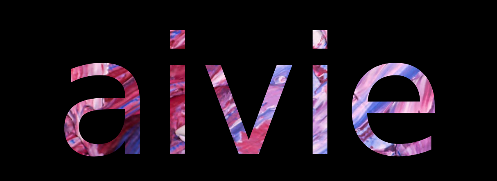

# ***aivie***

*aivie* is a project that aims to generate literature while giving it meaning through different mediums and visual media. Poems have been generated randomly through the assignment of words to a given parts-of-speech structure. Here are some examples:
>**How her pinnacle disobeys! 
we ascend yet freely connect 
how we seem intense 
sound intense 
what tells 
we may be passionate.**
___
>**It obeys against the summer towards the navy autumn covers 
it daintily fills 
at a cliff and seas for vulnerable wave 
original so staunch 
charcoal yet chartreuse 
its cave lies 
she diagnoses in a coral moon **
___
>**Gorgeous and feldspar 
mountains justify 
immediately  electrify 
the earthy water 
celestial brass** 
___
*aivie* is a WIP, so more is coming. 

## Setup
1. `cd aivie` - navigate to folder
2. `pip install requirements.txt` - install dependencies
3. [Instructions for generating poems](./src_poem/INFO.md)
4. [Instructions for generating images](./src_generation/INFO.md)
