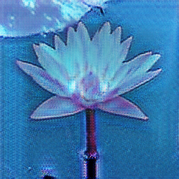

# ***aivie***

*aivie* is a project that aims to generate literature and visual art. Poems have been generated randomly through the assignment of words to a given parts-of-speech structure. More information about this process is located [here](./src_poem/INFO.md). The visual art has been generated using the [Cycle-GAN](https://arxiv.org/pdf/1703.10593.pdf) architecture. More information about this process is located [here](./src_generation/INFO.md).

## Examples


```
Where it sings?
How the forest dearly defies
Who joins!
Uselessly within the lighthouse
Cerulean butterfly absorbs
Silently frightens over the imitation
It obeys
It runs
Native wind adds
```

```
Why its cave begins?
They continue yet seriously fix
How you look zealous
Feel deplorable
Who ascends?
You are migratory?
```

## Setup
1. `cd aivie` - navigate to folder
2. `pip install requirements.txt` - install dependencies
3. [Instructions for generating poems](./src_poem/INFO.md)
4. [Instructions for generating images](./src_generation/INFO.md)
